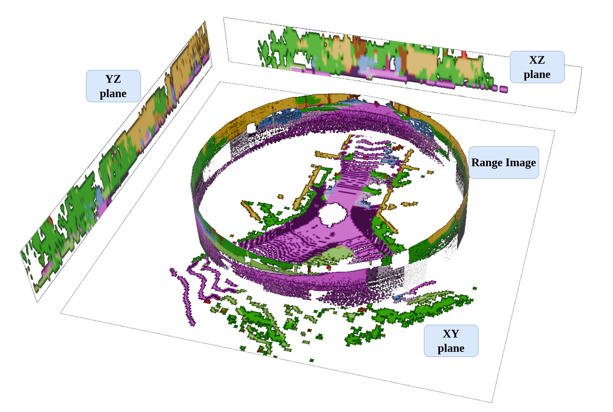
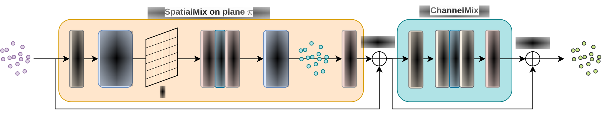

[**Exploiting Local Features and Range Images for Small Data Real-Time Point Cloud Semantic Segmentation**](https://ras.papercept.net/conferences/conferences/IROS24/program/IROS24_ContentListWeb_3.html#wepi3t5_03)  
[Daniel Fusaro](https://www.dei.unipd.it/en/persona/85ed20c7cab60b5a1ee989237cc70ec2),
[Simone Mosco](https://www.dei.unipd.it/persona/ec7b2218b236d88ae0be5ca08e73ab80),
[Alberto Pretto](https://www.dei.unipd.it/en/persona/C36EC9D29C2C5DFB03BFE9E045B32FD9)  
*All authors are within the Department of Information Engineering, University of Padova, Italy.*


If you find this code or work useful, please cite the following [paper](https://ras.papercept.net/conferences/conferences/IROS24/program/IROS24_ContentListWeb_3.html#wepi3t5_03):
```
@inproceedings{fusaro2024iros,
  title={Exploiting Local Features and Range Images for Small Data Real-Time Point Cloud Semantic Segmentation},
  author={Fusaro, Daniel and Mosco, Simone and Pretto, Alberto},
  booktitle={2024 IEEE/RSJ International Conference on Intelligent Robots and Systems (IROS)},
  year={2024}
}

// our paper has been accepted for publication at IROS 2024 [arXiv](https://arxiv.org/pdf/2410.10510)
```







## Installation

Setup the environment and clone this repo:
```
pip install pyaml==6.0 tqdm=4.63.0 scipy==1.8.0 torch==1.11.0 tensorboard=2.8.0
pip3 install pycuda pycu
git clone https://github.com/Bender97/WaffleAndRange
pip install -e ./
```

Then, compile the cuda related stuff.
```
cd cudastuff
mkdir build && cd build
cmake ..
make -j5
```


Download the trained models:
```
wget https://github.com/valeoai/WaffleIron/files/10294733/info_datasets.tar.gz
tar -xvzf info_datasets.tar.gz
```
[**SemanticKITTI model**](https://drive.google.com/file/d/1bSiQIvdA9P08NJS05qNXpcsAd6l_sIDw/view?usp=sharing)


## Testing pretrained models

To evaluate the SemanticKITTI trained model, type
```
python launch_train.py \
--dataset semantic_kitti \
--path_dataset /path/to/kitti/ \
--log_path ./pretrained_models/WaffleAndRange-256__kitti/ \
--config ./configs/WaffleIron-48-256__kitti.yaml \
--fp16 \
--restart \
--eval
```
This should give you a validation mIoU of 69.0 %.

**Remark:** *On SemanticKITTI, the code above will extract object instances on the train set (despite this being not necessary for validation) because this augmentation is activated for training on this dataset (and this code re-use the training script). This can be bypassed by editing the `yaml` config file and changing the entry `instance_cutmix` to `False`. The instances are saved automatically in `/tmp/semantic_kitti_instances/`.*

## Acknowledgements

#### WaffleIron
We thank the authors of
https://github.com/valeoai/WaffleIron

```
@inproceedings{puy23waffleiron,
  title={Using a Waffle Iron for Automotive Point Cloud Semantic Segmentation},
  author={Puy, Gilles and Boulch, Alexandre and Marlet, Renaud},
  booktitle={2023 IEEE/CVF International Conference on Computer Vision (ICCV)},
  year={2023}
}
```
since our implementation is based on their open source code.

#### RangeFormer
We thank the authors of Rangeformer
```
@inproceedings{kong2023iccv,
  author={Kong, Lingdong and Liu, Youquan and Chen, Runnan and Ma, Yuexin and Zhu, Xinge and Li, Yikang and Hou, Yuenan and Qiao, Yu and Liu, Ziwei},
  booktitle={2023 IEEE/CVF International Conference on Computer Vision (ICCV)}, 
  title={Rethinking Range View Representation for LiDAR Segmentation}, 
  year={2023}
}
```
for their work and and the author of https://github.com/nschi00/rangeview-rgb-lidar-fusion for their open source implementation of rangeformer.


#### cudaKDTree
We thank the author of
https://github.com/ingowald/cudaKDTree
for making their [implementation](https://github.com/ingowald/cudaKDTree) of the KDTree publicly available and very easy to use and understand.


## License
WaffleIron is released under the [Apache 2.0 license](./LICENSE). 

The implementation of the Lovász loss in `utils/lovasz.py` is released under 
[MIT Licence](https://github.com/bermanmaxim/LovaszSoftmax/blob/master/LICENSE).

WaffleAndRange is released under the [Apache 2.0 license](./LICENSE). 
